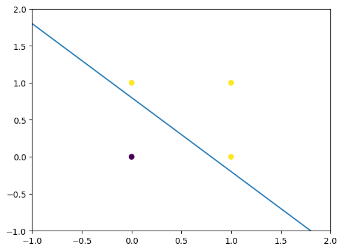

# OR Gate - SimplePerceptron

This is the code implementation of OR Gate using simple perceptron (Single Layer Perceptron).

We employ a simple Step Function as Activation function as follows:
```
# STEP Function
def step(NW,n):
  if (NW[n]>=Theta):
    return 1
  else:
    return 0
```

### Graph:
